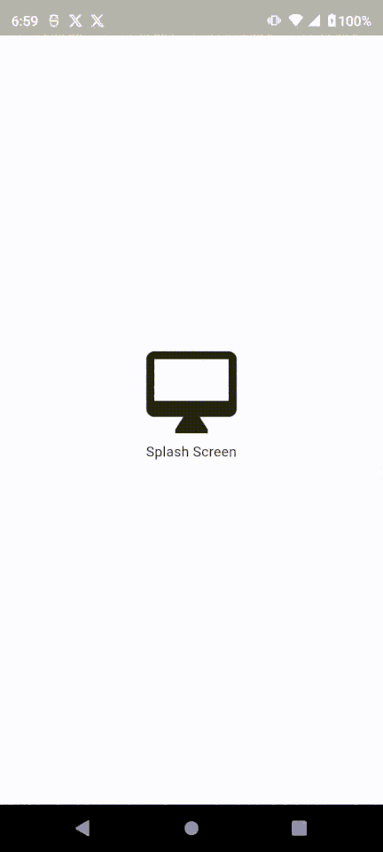

# Flutter - BLoC-Consumer Demo

A Flutter based Pagination Demo.

## Table of contents
- [Flutter Support](#flutter-support)
- [Demo](#demo)
- [Features](#features)
- [Getting started](#getting-started)
- [Usage](#usage)
- [Methods](#methods)
- [Want to Contribute?](#want-to-contribute)
- [Need Help / Support?](#need-help)
- [Collection of Components](#collection-of-Components)
- [Changelog](#changelog)
- [License](#license)
- [Keywords](#Keywords)

## Flutter Support

Version - Flutter 3.13.1
Dart 3.1.0

We have tested our program in above version, however you can use it in other versions as well.

## Demo
[

## Features

* User authentication with BLoC Clean architecture.
* Dio package used to network calls.

## Getting started

* Download this sample project and import dart files in your Flutter App.
* Update Widgets UI based on your requirements.
* Update Event & States based on your requirements.

## Usage

Setup process is described below to integrate in sample project.

### Methods

Pub dev dependencies

    flutter_bloc:
    dio:
    dartz:
    shared_preferences:
    toast:      

Add bloc into main.dart file

    MultiBlocProvider(
        providers: [BlocProvider(create: (context) => UserBloc())],
        child: //material widget
    )

BLoC class structure

    class UserBloc extends Bloc<UserEvent, UserState> {
        UserBloc() : super(UserInitial()) {
            on<UserEvent>((event, emit) async {
                ///listen all events and apply your logic accordingly
            }
        }
    }

Event class
    
    @immutable
    abstract class UserEvent {}

    class UserLoginEvent extends UserEvent {}

State class

    @immutable
    abstract class UserState {}

    class UserInitial extends UserState {}

Further implementation you can do as per requirement and usage

## Want to Contribute?

- Created something awesome, made this code better, added some functionality, or whatever (this is the hardest part).
- [Fork it](http://help.github.com/forking/).
- Create new branch to contribute your changes.
- Commit all your changes to your branch.
- Submit a [pull request](http://help.github.com/pull-requests/).

## Collection of Components

We have built many other components and free resources for software development in various programming languages. Kindly click here to view our [Free Resources for Software Development.](https://www.weblineindia.com/software-development-resources.html)

## Changelog

Detailed changes for each release are documented in [CHANGELOG](./CHANGELOG).

## License

[MIT](LICENSE)

[mit]: ./LICENSE

## Keywords

Flutter-BLoC, BLoC, BLoC-State-Management, State-Management, Flutter-State_Management
